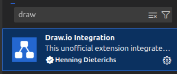
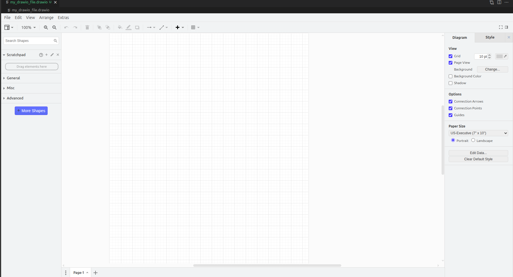
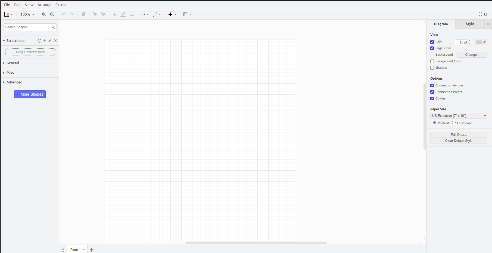
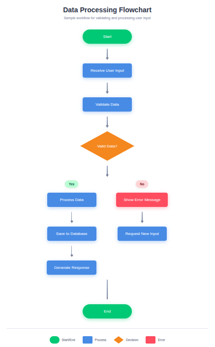
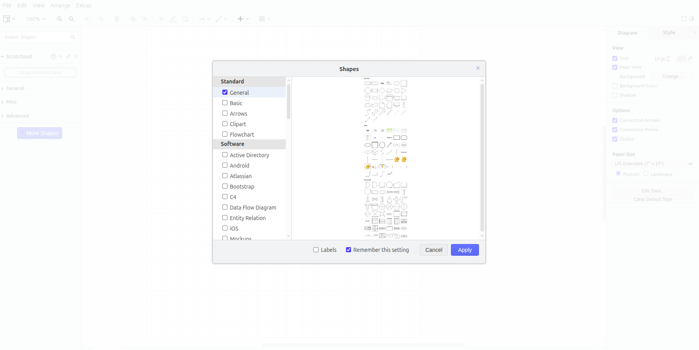

# Draw.io Integration in VS Code

Create professional diagrams, flowcharts, and visual designs directly inside VS Code without leaving your editor. This guide shows you how to set up and use Draw.io in VS Code.

## What is Draw.io?

Draw.io (also known as diagrams.net) is a free diagramming tool that lets you create:
- Flowcharts
- UML diagrams
- Network diagrams
- Wireframes
- Mind maps
- Architecture diagrams

## Installation

### Step 1: Install the Extension

Open VS Code and press `Ctrl+Shift+X` to open Extensions. Search for "Draw.io Integration" and install it.

The official extension is published by **Henning Dieterichs**.

### Step 2: Verify Installation

After installation, you're ready to start creating diagrams! No additional setup needed.

## Creating Your First Diagram

### Method 1: Create New Diagram File

1. In VS Code, press `Ctrl+N` to create a new file
2. Save it with a `.drawio` extension (e.g., `flowchart.drawio`)
3. The Draw.io editor opens automatically

### Method 2: Using Command Palette

1. Press `Ctrl+Shift+P`
2. Type "Draw.io: Create New Diagram"
3. Choose your file name and location

## Using the Editor

### Basic Tools

The Draw.io editor has several panels:

**Left Sidebar:** Shape library (flowchart symbols, UML, network icons, etc.)

**Top Toolbar:** Formatting options (colors, line styles, text)

**Right Panel:** Advanced properties (size, position, alignment)

### Quick Actions

- **Add Shape:** Drag from left sidebar onto canvas
- **Connect Shapes:** Click connector icon, then drag between shapes
- **Edit Text:** Double-click any shape
- **Delete:** Select shape and press `Delete`
- **Undo/Redo:** `Ctrl+Z` / `Ctrl+Y`

## Example: Create a Simple Flowchart

Here's how to make a basic flowchart:

### Step 1: Add Start Symbol
1. Open shape library → Flowchart
2. Drag "Terminator" shape to canvas
3. Double-click and type "Start"

### Step 2: Add Process Steps
1. Drag "Rectangle" shapes for process steps
2. Add text like "Read Input", "Process Data"

### Step 3: Add Decision Points
1. Drag "Diamond" shape for decisions
2. Add text like "Valid Data?"

### Step 4: Connect Everything
1. Click the connector tool (arrow icon)
2. Click first shape, drag to second shape
3. Add labels to arrows (Yes/No)

## File Formats

### Supported Formats

Draw.io in VS Code supports multiple formats:

- `.drawio` - Native format (recommended)
- `.drawio.svg` - SVG with embedded diagram data
- `.drawio.png` - PNG with embedded diagram data

### Export Options

Right-click on the canvas:
- Export as PNG
- Export as SVG
- Export as PDF
- Export as XML

## Tips and Tricks

### Theme Integration

Draw.io automatically matches your VS Code theme:
- Light theme → White canvas
- Dark theme → Dark canvas

### Keyboard Shortcuts

- `Ctrl+C` / `Ctrl+V` - Copy/Paste shapes
- `Ctrl+D` - Duplicate selected shape
- `Ctrl+G` - Group shapes
- `Ctrl+Shift+G` - Ungroup shapes
- `Alt+Shift+Arrow` - Align shapes

### Shape Libraries

Access more shapes:
1. Click "More Shapes" at bottom of left sidebar
2. Enable categories you need (AWS, Azure, Network, etc.)
3. Click "Apply"

### Grid and Snap

- **Show Grid:** View menu → Grid
- **Snap to Grid:** Automatically enabled (helps align shapes)
- **Change Grid Size:** File → Properties → Grid Size

## Common Use Cases

### 1. Software Architecture Diagrams

Use rectangles and connectors to show:
- System components
- Data flow
- API connections

### 2. Database Schema

Use entity boxes to show:
- Tables and relationships
- Primary/Foreign keys
- One-to-many connections

### 3. User Flow Diagrams

Map user journeys with:
- Decision points
- Actions
- Screen transitions

### 4. Network Topology

Design networks using:
- Server icons
- Network devices
- Connection lines

## Collaboration

### Version Control

Since `.drawio` files are XML-based:
- ✅ Works great with Git
- ✅ Can see changes in diffs
- ✅ Easy to merge branches
- ✅ Track diagram evolution

### Sharing Diagrams

Export diagrams for sharing:
- PNG for presentations
- SVG for web pages
- PDF for documentation

## Troubleshooting

**Extension not opening .drawio files?**
- Right-click file → "Open With" → "Draw.io Editor"
- Set as default editor for .drawio files

**Shapes not showing?**
- Reload VS Code window
- Check internet connection (some shape libraries load from CDN)

**Can't find specific shapes?**
- Click "More Shapes" and enable additional libraries
- Search for shapes using the search box

**Diagram looks different on another computer?**
- Font might not be installed
- Use web-safe fonts (Arial, Times New Roman, Courier)

## Advanced Features

### Custom Shape Libraries

Create reusable shape sets:
1. File → New Library
2. Drag shapes you want to reuse
3. Save library file
4. Load in any project

### Layers

Organize complex diagrams:
1. View → Layers
2. Add new layer
3. Move shapes between layers
4. Show/hide layers

### Mathematical Formulas

Add LaTeX formulas:
1. Insert → Advanced → Mathematical Typesetting
2. Enter LaTeX code
3. Renders as formatted math

## Resources

- Official Draw.io docs: https://www.diagrams.net/doc/
- Shape library gallery: https://www.diagrams.net/example-diagrams
- VS Code extension: Search "Draw.io Integration" in Extensions

---

Now you can create beautiful diagrams without leaving VS Code! 🎨
